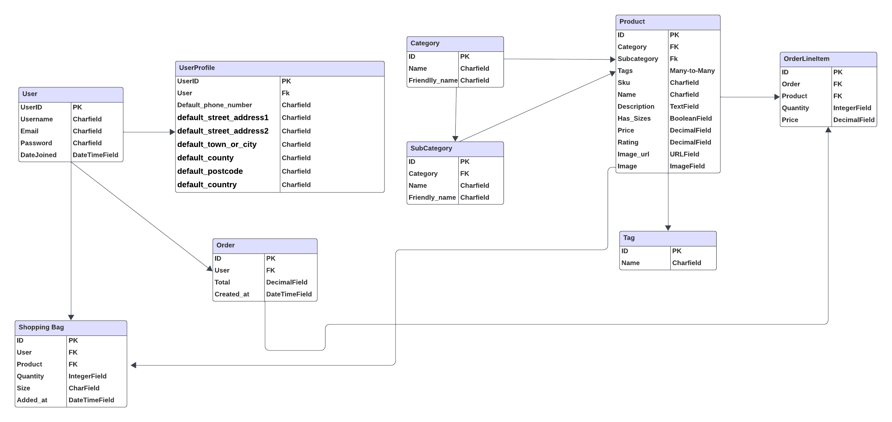
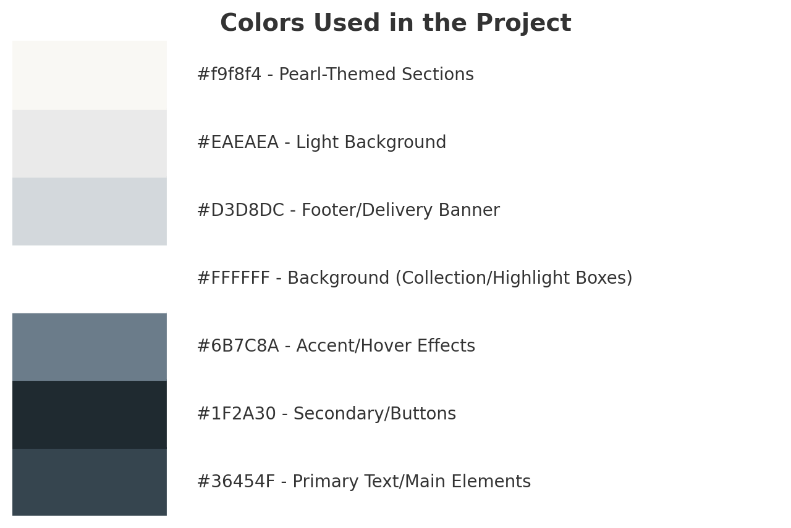

# CharmChic - Pearls Jewelry E-Commerce Project

## Introduction

CharmChic is a sophisticated e-commerce platform specializing in high-quality pearl jewelry.
It offers a seamless shopping experience with an intuitive and responsive design.

Built using Django, Python, HTML, CSS, and JavaScript, it ensures efficiency.

The platform integrates Stripe to simulate secure payment processing for users.
As a demonstration project, no real transactions are processed, and orders remain incomplete.

To explore the payment feature, you can use the following test card details (provided by Stripe):

- Card number: 4242 4242 4242 4242

- Expiry date: Any future date (e.g., 11/26)

- CVC: Any 3 digits (e.g., 123)


LIVE SITE

[You can view the live site here.](https://charm-chic-aed25148762b.herokuapp.com/)

GITHUB PAGES

[You can view the GitHub code pages here.](https://github.com/Cristina-Becheru/charm-chic.git)

## Table of Contents

- [CharmChic - Pearls Jewelry E-Commerce Project](#charmchic---pearls-jewelry-e-commerce-project)
  - [Introduction](#introduction)
  - [User E-commerce Experience](#user-e-commerce-experience)
    - [Shopper Goals](#shopper-goals)
    - [Store Owner Goals](#store-owner-goals)
  - [Website Sections](#website-sections)
  - [Features](#features)
    - [Index/Home Page Features](#indexhome-page-features)
    - [All Products Page Features](#all-products-page-features)
    - [Product Detail Page Features](#product-detail-page-features)
    - [About Page Features](#about-page-features)
    - [Contact Page Features](#contact-page-features)
    - [Shopping Bag Features](#shopping-bag-features)
    - [Checkout Page Features](#checkout-page-features)
    - [Checkout Success Page Features](#checkout-success-page-features)
    - [Product Management - Add Product](#product-management---add-product)
    - [Profile Page Features](#profile-page-features)
    - [Login Page Features](#login-page-features)
    - [Sign Up Page Features](#sign-up-page-features)
  - [Future Goals](#future-goals)
  - [Error Handling](#error-handling)
  - [Layout](#layout)
    - [Typography](#typography)
  - [Marketing](#marketing)
    - [E-commerce Business Model](#e-commerce-business-model)
    - [SEO](#seo)
    - [Testing](#testing)
  - [Technologies Used](#technologies-used)
    - [Languages, Frameworks, Libraries & Programs Used](#languages-frameworks-libraries--programs-used)
    - [Packages and Dependencies](#packages-and-dependencies)
    - [External Tools & Programs Used](#external-tools--programs-used)
  - [Deployment](#deployment)
  - [Credits](#credits)
  - [Acknowledgements](#acknowledgements)

## User E-commerce Experience

### Shopper Goals
1. **Effortless Product Discovery**
   - Shoppers can easily browse categories of jewelry such as necklaces, earrings, bracelets, and rings to find items matching their preferences.
   - Shoppers can search for specific products and sort them by price, popularity, or new arrivals for a more targeted shopping experience.
   - A responsive design ensures smooth navigation across desktop, tablet, and mobile devices.

2. **Comprehensive Product Details**
   - Detailed product descriptions, including high-quality images, materials, pricing, and available sizes, help shoppers make informed purchasing decisions.
   - Related products and recommendations provide inspiration for additional purchases.

3. **Convenient Shopping Bag**
   - Shoppers can add items to their shopping bag, adjust quantities, or remove items before proceeding to checkout.
   - A clear breakdown of costs, including subtotals, delivery charges, and grand totals, ensures transparency.
   - Automatic calculation of free delivery thresholds encourages larger purchases.

4. **Secure and Hassle-Free Checkout**
   - Shoppers can securely enter their billing and delivery information and choose from multiple payment options, including Stripe.
   - Email confirmations and detailed order summaries provide peace of mind after completing purchases.
   - Guest checkout is available for customers who do not wish to register.

5. **Profile and Order History**
   - Registered shoppers can access a personalized profile page to manage delivery information and view order history.
   - The ability to save delivery details streamlines the checkout process for future orders.

6. **Support and Communication**
   - Shoppers can use the contact form to send inquiries and receive prompt responses from the store owner.
   - A newsletter subscription keeps shoppers updated about promotions, new arrivals, and exclusive offers.

7. **Trust and Transparency**
   - Easy access to the store's Terms and Conditions, Privacy Policy, and Return Policy ensures a secure and transparent shopping experience.
   - Visible customer reviews and ratings build trust in product quality and service reliability.

---

### Store Owner Goals
1. **Efficient Product Management**
   - The store owner can add, edit, or delete products in the catalog to keep the inventory accurate and up to date.
   - High-quality images and detailed product descriptions attract and inform potential customers.

2. **Order Management**
   - The store owner can view and manage orders efficiently to ensure timely delivery and customer satisfaction.
   - Email notifications for each new order allow prompt processing.

3. **Customer Engagement**
   - Social media links and newsletters enable the store owner to connect with customers and build a loyal customer base.
   - Prompt responses to customer inquiries via the contact form enhance customer satisfaction and trust.

4. **Business Insights**
   - Sales trends and popular product data help the store owner make informed decisions about inventory and promotions.
   - The ability to view customer order patterns assists in creating targeted marketing campaigns.

5. **Smooth Checkout Experience**
   - A secure and reliable Stripe payment gateway ensures smooth transaction processing for both customers and the business.
   - The ability to display and adjust shipping costs provides flexibility for different regions or promotions.

6. **Website Maintenance**
   - A visually appealing, responsive, and easy-to-navigate website ensures a seamless shopping experience for users on all devices.
   - Regular updates and announcements help maintain a professional and engaging platform.

7. **Building Brand Identity**
   - Showcasing unique, handcrafted products highlights the brand's quality and originality.
   - Sharing the store’s story and values on the About Us page creates a personal connection with customers.

8. **Growth and Expansion**
   - Email list building through newsletters creates a direct communication channel with potential and loyal customers.
   - The ability to feature promotions, discounts, and new arrivals increases sales opportunities.

## Website Sections

- **Products**
- **Index/Home**
- **About Us**
- **Contact Page**
- **Shopping Bag**
- **Checkout**
- **Admin - Add/Edit Product Page**
- **Product Description**
- **Checkout Success**
- **Log In**
- **Sign Up**
- **Profile**

## Features
### Index/Home Page Features

| **Feature**                 | **Description**                                                                                     |
|-----------------------------|-----------------------------------------------------------------------------------------------------|
| **Nav Bar**                 | A fully responsive navigation bar allows users to navigate the site, view their shopping bag total, and search for specific products. |
| **Hero Section**            | A captivating hero section featuring a video background and an overlay with a brand tagline and a call-to-action button directing users to the products page. |
| **Collection Section**      | Highlights the collection with a left-aligned image and a text box showcasing the brand's elegance and inviting users to explore the collection. |
| **Shop by Category**        | Displays categories (Necklaces, Earrings, Bracelets, and Rings) with hover effects and links to specific product categories. |
| **Services Section**        | Showcases the services offered, such as free delivery, cleaning and maintenance, free gift wrapping, and unique handcrafted products. Each service is displayed with an icon, title, and description. |
| **Newsletter Subscription** | A form where users can input their email address to subscribe to the Charm Chic newsletter and receive updates about new arrivals, promotions, and news. |
| **Important Links**         | Provides direct links to the **Terms and Conditions**, **Privacy Policy**, and **Return Policy** pages for user convenience. |
| **Contact Information**     | Displays the business address, a contact email, and a link to a contact form, enabling users to easily reach out for inquiries or support. |
| **Social Media Links**       | Includes clickable icons for **Facebook**, **Instagram**, **Twitter**, and **GitHub**, which open in new tabs to connect users with Charm Chic’s social platforms. |

### All products Page Features
| **Feature**             | **Description**                                                                                     |
|-------------------------|-----------------------------------------------------------------------------------------------------|
| **Nav Bar**             | A fully responsive navigation bar allows users to navigate the site, view their shopping bag total, and search for specific products. |
| **Page Header**         | Displays the title "Pearls Collection" to help users identify the page.                            |
| **Category Links**      | Displays clickable category badges at the top of the page to allow users to filter products by category. |
| **Product Count**       | Shows the total number of products available and displays the search term if applicable.           |
| **Sorting Dropdown**    | A dropdown menu that allows users to sort products by price (low to high or high to low) or name (A-Z or Z-A). |
| **Product Grid**        | Displays products in a grid format, showing their images, names, prices, and subcategories.        |
| **Product Details Link**| Includes a "View Details" link for each product, allowing users to navigate to its detailed page.   |
| **Edit and Delete Buttons** | Allows admin users to edit or delete products directly from the product grid.                    |
| **Back-to-Top Button**  | A button that appears while scrolling down, enabling users to quickly return to the top of the page.|
| **No Products Message** | Displays a message informing users when no products match their search or selected filters.         |


### Product Detail Page Features
| **Feature**              | **Description**                                                                                     |
|--------------------------|-----------------------------------------------------------------------------------------------------|
| **Nav Bar**              | A fully responsive navigation bar allows users to navigate the site, view their shopping bag total, and search for specific products. |
| **Product Image**        | Displays the main image of the product. Clicking on the image opens a larger view in a new tab.      |
| **Product Details**      | Displays the product name, price, description, and category/subcategory if applicable.               |
| **Product Rating**       | Shows a star-based rating for the product, or "No Rating" if unavailable.                           |
| **Edit and Delete Buttons** | Allows admin users to edit or delete the product directly from the page.                           |
| **Size Selector**        | Provides a dropdown menu for selecting the product size if size options are available.               |
| **Quantity Selector**    | Includes buttons to increase or decrease the quantity, and an input field for setting a specific quantity. |
| **Add to Bag Button**    | Adds the selected product with chosen size and quantity to the shopping bag.                        |
| **Keep Shopping Button** | Redirects the user back to the products page to continue browsing.                                   |
| **Back to Product List** | A hidden form input captures the current page URL for redirecting users back to the product list after adding items to the bag. |

### About Page Features
| **Feature**             | **Description**                                                                                     |
|-------------------------|-----------------------------------------------------------------------------------------------------|
| **Page Header**         | Displays a welcoming title, "Welcome to CharmChic," with styled separators for a polished look.    |
| **About Us Section**    | Shares the story behind CharmChic, highlighting its passion for pearls, handcrafted jewelry, and commitment to ethical sourcing. |
| **Image Display**       | Features an elegant image related to pearls and craftsmanship, reinforcing the brand's aesthetic.   |
| **Mission Statement**   | Describes CharmChic's focus on blending timeless elegance with contemporary design while offering affordable luxury. |
| **Call to Action Button** | A button labeled "Explore Our Collection" encourages users to browse the product catalog.          |

### Contact Page Features
| **Feature**             | **Description**                                                                                     |
|-------------------------|-----------------------------------------------------------------------------------------------------|
| **Page Header**         | Displays a welcoming title, "Reach out to us," encouraging users to connect with CharmChic.         |
| **Contact Form**        | Includes fields for Full Name, Email Address, Phone Number, and a Message box for user inquiries.    |
| **Submit Button**       | A "Send" button allows users to submit their queries or feedback.                                   |
| **Back to Shop Button** | A button that redirects users back to the products page for further browsing.                       |
| **Interactive Layout**  | A centered card-style layout with a clean and organized appearance for an easy user experience.      |
| **CSRF Protection**     | Ensures secure form submission with CSRF tokens included in the form.                               |
### Shopping Bag Features
| **Feature**             | **Description**                                                                                     |
|-------------------------|-----------------------------------------------------------------------------------------------------|
| **Page Header**         | Displays the title "Shopping Bag" to help users identify the page.                                 |
| **Bag Items List**      | Lists all the items currently in the shopping bag with their details, including name, size, quantity, and prices. |
| **Product Image**       | Displays a thumbnail image of each product in the shopping bag. If no image is available, a placeholder is shown. |
| **Quantity Selector**   | Includes buttons to increment or decrement the quantity of items and an input field to manually update the quantity. |
| **Update Button**       | Allows users to update the quantity of a specific item in the bag.                                  |
| **Remove Button**       | Enables users to remove a specific item from the bag entirely.                                      |
| **Unit Price**          | Shows the price per unit of each item.                                                              |
| **Total Price**         | Displays the total price for each item based on its quantity.                                       |
| **Bag Total Summary**   | Displays the bag total, delivery cost, and grand total. Alerts users if they are close to qualifying for free delivery. |
| **Navigation Buttons**  | Provides buttons to continue shopping or proceed to the checkout page.                              |
| **Empty Bag Message**   | Displays a message and a button to redirect users to the products page when the shopping bag is empty. |

### Checkout Page Features
| **Feature**             | **Description**                                                                                     |
|-------------------------|-----------------------------------------------------------------------------------------------------|
| **Page Header**         | Displays the title "Checkout" to help users identify the page.                                     |
| **Order Summary**       | Provides a detailed summary of the products in the bag, including images, names, sizes, quantities, and prices. |
| **Order Totals**        | Displays the total cost, delivery charges, and grand total for the order.                          |
| **Personal Details Form** | A section where users enter their full name and email address.                                    |
| **Delivery Address Form** | Allows users to input their phone number, address, and postal information for delivery.           |
| **Save Information Option** | Logged-in users can save their delivery information for future use, while new users are prompted to sign up or log in. |
| **Payment Details Section** | Includes a Stripe card element for users to input their card information securely.              |
| **Submit Button**       | A "Complete Order" button submits the form and processes the payment.                              |
| **Back to Bag Button**  | Redirects users back to the shopping bag page for adjustments.                                      |
| **Loading Overlay**     | Displays a loading spinner while the payment is being processed to enhance user feedback.           |
| **CSRF Protection**     | Ensures secure form submission with CSRF tokens.                                                   |
| **Stripe Integration**  | Uses Stripe for secure payment processing with real-time validation of card details.                |

### Checkout Success Page Features

| **Feature**               | **Description**                                                                                     |
|---------------------------|-----------------------------------------------------------------------------------------------------|
| **Page Header**           | Displays the title "Order Confirmation" to indicate the successful completion of the checkout process. |
| **Thank You Message**     | Shows a confirmation message thanking the user for their order, including the order number, email, and date of purchase. |
| **Order Details Section** | Provides a summary of the purchased items, including product images, names, sizes, quantities, and total price for each item. |
| **Delivery Information**  | Displays the user's delivery information, including name, phone number, and address.                |
| **Total Summary**         | Summarizes the order costs, including the subtotal, delivery cost, and grand total.                 |
| **Navigation Buttons**    | Includes buttons for navigating back to the profile page (if accessed from there) or exploring new arrivals. |
| **Responsive Design**     | Ensures the layout adjusts seamlessly for different screen sizes and devices.                       |

### Product Management - Add Product

| **Feature**               | **Description**                                                                                     |
|---------------------------|-----------------------------------------------------------------------------------------------------|
| **Page Header**           | Displays the title "Add Product" to indicate the user is on the product management page.            |
| **Form for Adding Products** | Allows admin users to fill out a form to add a new product to the database.                       |
| **Rating Guide**          | Includes a tooltip guide explaining the product rating system (1 to 5 stars).                       |
| **Image Upload**          | Provides an input field for uploading a product image, with a preview of the filename upon selection.|
| **Cancel Button**         | Redirects the admin back to the product list without saving changes.                                |
| **Add Product Button**    | Submits the form to add the new product to the store.                                               |
| **Responsive Design**     | Ensures the form layout adjusts seamlessly for different screen sizes and devices.                  |

### Profile Page Features

| **Feature**               | **Description**                                                                                     |
|---------------------------|-----------------------------------------------------------------------------------------------------|
| **Page Header**           | Displays the title "My Profile" to indicate the user is on their profile page.                      |
| **Delivery Information**  | Includes a form where users can update their default delivery information for future orders.        |
| **Order History**         | Shows a table listing the user's previous orders, including order numbers (clickable for details), dates, items, and grand totals. |
| **Order Details Link**    | Each order number is clickable and redirects users to the detailed order history page.              |
| **Responsive Design**     | Ensures the layout adjusts seamlessly for different screen sizes and devices.                       |
| **Update Information Button** | Allows users to save their updated delivery information.                                           |
| **Dynamic Table**         | Order details dynamically populate using past order data for better user experience.                |

### Login Page

| **Feature**               | **Description**                                                                                      |
|---------------------------|------------------------------------------------------------------------------------------------------|
| **Page Header**           | Displays the title "Sign In" to indicate the user is on the login page.                              |
| **Sign-Up Prompt**        | Provides a message encouraging new users to sign up for an account with a link to the registration page. |
| **Login Form**            | A form that allows users to input their credentials (e.g., username and password) to log in.         |
| **Redirect Field**        | Includes a hidden field to redirect users to the desired page after successful login.                |
| **Home Button**           | Provides a button to redirect users back to the home page if they decide not to log in.              |
| **Sign In Button**        | Submits the form to authenticate the user and log them into their account.                           |
| **Responsive Design**     | Ensures the page layout adjusts seamlessly for different screen sizes and devices.                   |

### Sign Up Page

| **Feature**               | **Description**                                                                                      |
|---------------------------|------------------------------------------------------------------------------------------------------|
| **Page Header**           | Displays the title "Sign Up" to indicate the user is on the registration page.                       |
| **Sign-In Prompt**        | Includes a message for users who already have an account, with a link to the login page.             |
| **Sign-Up Form**          | A form where users can provide their details (e.g., username, email, password) to register.          |
| **Redirect Field**        | Includes a hidden field to redirect users to the intended page after successful registration.         |
| **Back to Login Button**  | Redirects users to the login page if they decide not to sign up and wish to log in instead.           |
| **Sign Up Button**        | Submits the registration form to create a new user account.                                          |
| **Responsive Design**     | Ensures the page layout adjusts seamlessly for different screen sizes and devices.                   |

### Future Goals

CharmChic aims to enhance the user experience and expand its features in the future. The planned improvements include:

| **Goal**                                    | **Description**                                                                                         |
|---------------------------------------------|---------------------------------------------------------------------------------------------------------|
| **Wishlist Functionality**                  | Allow users to save their favorite items to a wishlist for later purchase.                              |
| **Advanced Filtering**                      | Implement more detailed filtering options, such as filtering by price range, material, or occasion.     |
| **Customer Reviews**                        | Enable customers to leave reviews and ratings on products, helping others make informed decisions.      |
| **Loyalty Program**                         | Introduce a rewards system where users can earn points for purchases and redeem them for discounts.     |
| **Enhanced Product Descriptions**           | Add 360-degree views and detailed videos for products to improve visualization and customer confidence.  |
| **Order Tracking**                          | Provide real-time order tracking for customers to monitor the delivery progress of their purchases.      |
| **Mobile App Integration**                  | Develop a mobile application for an optimized shopping experience on smartphones and tablets.           |
| **Personalized Recommendations**            | Use machine learning to suggest products based on customer preferences and purchase history.            |
| **Multi-language Support**                  | Expand the platform to support multiple languages for a broader customer base.                          |
| **Expanded Payment Options**                | Add support for alternative payment methods like PayPal, Apple Pay, and Google Pay.                     |
| **Blog Section**                            | Create a blog section featuring jewelry care tips, style guides, and updates about pearl collections.   |
| **Live Chat Support**                       | Offer a real-time customer support feature to assist with inquiries instantly.                          |
| **Wholesale Options**                       | Enable bulk purchase options for businesses or special occasions like weddings.                         |
| **Gift Cards**                              | Introduce digital gift cards for customers to send as gifts to their loved ones.                        |

### Favicon Integration

A favicon has been added to the project to enhance the branding and provide a polished user experience.

### Future Goals

CharmChic aims to enhance the user experience and expand its features in the future. The planned improvements include:

| **Goal**                                    | **Description**                                                                                         |
|---------------------------------------------|---------------------------------------------------------------------------------------------------------|
| **Wishlist Functionality**                  | Allow users to save their favorite items to a wishlist for later purchase.                              |
| **Advanced Filtering**                      | Implement more detailed filtering options, such as filtering by price range, material, or occasion.     |
| **Customer Reviews**                        | Enable customers to leave reviews and ratings on products, helping others make informed decisions.      |
| **Loyalty Program**                         | Introduce a rewards system where users can earn points for purchases and redeem them for discounts.     |
| **Enhanced Product Descriptions**           | Add 360-degree views and detailed videos for products to improve visualization and customer confidence.  |
| **Order Tracking**                          | Provide real-time order tracking for customers to monitor the delivery progress of their purchases.      |
| **Mobile App Integration**                  | Develop a mobile application for an optimized shopping experience on smartphones and tablets.           |
| **Personalized Recommendations**            | Use machine learning to suggest products based on customer preferences and purchase history.            |
| **Multi-language Support**                  | Expand the platform to support multiple languages for a broader customer base.                          |
| **Expanded Payment Options**                | Add support for alternative payment methods like PayPal, Apple Pay, and Google Pay.                     |
| **Blog Section**                            | Create a blog section featuring jewelry care tips, style guides, and updates about pearl collections.   |
| **Live Chat Support**                       | Offer a real-time customer support feature to assist with inquiries instantly.                          |
| **Gift Cards**                              | Introduce digital gift cards for customers to send as gifts to their loved ones.                        |

## Structure
#### Database Design

For this project, a relational database was used to manage structured connections between related data efficiently. This approach ensures data integrity and simplifies querying across multiple related tables.

To represent the database schema visually, [Lucidchart](https://www.lucidchart.com/) was utilized to design and showcase the relationships between the tables.




### Error Handling

To ensure a seamless user experience and provide clear communication during errors, the following measures have been implemented:

- **Custom 404 Page**: Users are redirected to a friendly 404 error page if they attempt to access a non-existent page. This page includes a helpful message and a button to guide them back to the homepage.

- **Custom 500 Page**: For internal server errors, users are shown a custom 500 error page that explains the issue and offers a button to return to the homepage.

- **Database Object Validation**: The `get_object_or_404` function is used to handle cases where a requested database object (e.g., a product) does not exist. This ensures users cannot access or interact with unavailable products and are instead shown a 404 error.

- **Real-Time Toast Notifications**: Toast notifications are used to provide immediate feedback for user actions, such as successfully adding an item to the shopping bag or encountering an error. These notifications appear in the top-right corner of the screen, ensuring users are informed without disrupting their experience.

## Layout
### Typography
- The Babylonica font was chosen for its elegant and sophisticated style, aligning with the luxurious theme of CharmChic.

It ensures readability and enhances the site's overall aesthetic with clean, modern text presentation across all devices.
### Colors Used in the Project

The following colors were used throughout the project to create a cohesive and elegant design:



These colors provide a sophisticated and timeless aesthetic, reflecting the elegance of the Charm Chic brand.

## Marketing
### E-commerce Business Model
Charm Chic operates under a B2C (Business-to-Customer) model, specializing in the sale of luxurious pearl jewelry directly to customers. The platform enables customers to browse, select, and purchase products seamlessly, offering a guest checkout option for quick transactions without requiring registration.

The business leverages digital marketing channels, such as social media platforms like Instagram and Facebook, to promote its brand and engage with potential customers. This strategy helps build a loyal customer base by showcasing the elegance and craftsmanship of Charm Chic's products.

*Target Audience:*

Charm Chic caters to individuals who appreciate timeless and sophisticated jewelry. This includes fashion enthusiasts, gift shoppers, and anyone seeking elegant, handcrafted pearls for special occasions or daily wear. 
Customers value Charm Chic for its:
- High-quality materials
- Unique and elegant designs
- Fair pricing and reliability

*Product Offering:*

The collection includes a wide range of pearl jewelry, such as:

- Necklaces
- Earrings
- Bracelets
- Rings

Each piece is designed to enhance the wearer’s style with a touch of grace and refinement.

### SEO
The project incorporates comprehensive SEO enhancements to improve search engine visibility and user reach. 

*Keywords*:
A carefully selected list of keywords tailored to the site's offerings:

- pearl jewelry
- pearl earrings
- pearl necklaces
- pearl bracelets
- luxury jewelry
- elegant pearls
- fine jewelry
- fashion accessories
- pearl rings
- elegant jewelry
- handcrafted pearls

#### Additional SEO Enhancements:
**Sitemap.xml:**
A dynamically generated sitemap.xml file ensures that all pages are indexed efficiently by search engines, providing a clear map of the website's structure.

**Robots.txt**:
The robots.txt file is configured to guide search engine crawlers on which parts of the website should or should not be indexed, ensuring focus on relevant content.

## Testing
The site was thoroughly tested during development, with immediate fixes applied to resolve any issues.

Details of testing and bug resolutions are documented in the file below.

[TESTING.md file](TESTING.md)

## Technologies used

### Languages, Frameworks, Libraries & Programs Used
- Python: Used as the core programming language for backend development, server-side logic, and database interactions.
- Django: A powerful Python-based web framework used to build the backend and manage server-side functionality.
- SQLite3: A lightweight, file-based database used for local development and testing.
- Stripe: Integrated for secure payment processing and simulated transactions.
- Crispy Forms: Used to enhance the usability and styling of Django forms.
- PostgreSQL: A robust and scalable database solution used in the production environment.
- HTML & CSS: Used for structuring and styling the website.
- Bootstrap: Utilized for creating responsive, mobile-friendly, and visually appealing layouts.
- jQuery: Integrated for handling interactivity, event handling, and DOM manipulation.
- Cloudinary: A cloud-based solution for managing, optimizing, and delivering media assets.
- Git: Used for version control and collaboration among developers.
- Heroku: A cloud platform used for deploying and hosting the website.
- Google Fonts: Incorporated for elegant typography and improving the site's design aesthetics.
- W3C Markup Validator: Used to ensure the validity and standards compliance of the HTML code.
- W3C CSS Validator: Employed to validate CSS code for correctness and best practices adherence.
- Lighthouse: A tool used for auditing and optimizing performance, accessibility, SEO, and best practices.
- VS Code: The integrated development environment (IDE) used for coding, debugging, and project management.
- ChatGPT: Utilized for generating content, refining project details, and brainstorming improvements.

## Packages and Dependencies 
The following packages and dependencies are used in this project:

- asgiref (3.8.1): Provides asynchronous support for Django.
- cloudinary (1.41.0): Used for cloud-based media storage and management.
- dj-database-url (0.5.0): Simplifies the configuration of database connections.
- Django (4.2.16): The main web framework used for building the application.
- django-allauth (65.2.0): Handles user authentication, registration, and account management.
- django-cloudinary-storage (0.3.0): Integrates Cloudinary with Django for media storage.
- django-countries (7.6.1): Provides country-related functionality in Django forms and models.
- django-crispy-forms (1.14.0): Enhances the appearance and functionality of forms in Django.
- gunicorn (23.0.0): A WSGI HTTP server for running the application in production.
- pillow (11.0.0): Used for image processing.
- psycopg2 (2.9.10): PostgreSQL adapter for Django, used in production environments.
- python-dotenv (1.0.1): Loads environment variables from a .env file for configuration.
- pytz (2024.2): Handles time zone information for Django.
- sqlparse (0.5.2): A library used by Django for parsing SQL queries.
- stripe (11.2.0): Integrated for handling payment processing securely.
- whitenoise (6.8.2): Simplifies static file management in production.

## External Tools & Programs Used
- [TermsFeed](https://app.termsfeed.com/): Used to generate policies, including terms and conditions and return conditions for the website.
- [Mailchimp](https://mailchimp.com/): Integrated to allow users to subscribe to the newsletter.
- [CloudConvert](https://cloudconvert.com/): Utilized for converting static images from JPG to WebP format for optimized performance.
- [ToWebP](https://towebp.io/webp-to-jpg): Used to transform WebP images in bulk back to JPG format when needed.
- [Pexels](https://towebp.io/webp-to-jpg): Source for video and images featured on the website.

### Deployment

This project is deployed using **Heroku**, with **PostgreSQL** as the production database, **Cloudinary** for media file storage, and **SQLite3** for local development.

| **Step**                     | **Details**                                                                                                                                                   |
|------------------------------|---------------------------------------------------------------------------------------------------------------------------------------------------------------|
| **Create Heroku App**        | Log in to [Heroku](https://www.heroku.com/), create a new app, and name it uniquely. Choose the region closest to your location.                              |
| **Add PostgreSQL**           | In the **Resources** tab, search for **Heroku Postgres** and add it to the app to serve as the production database.                                           |
| **Set Config Vars**          | Go to the **Settings** tab in Heroku and click **Reveal Config Vars**. Add necessary variables:                                                              |
|                              | - `CLOUDINARY_URL`: Your Cloudinary API URL                                                                                                                  |
|                              | - `DATABASE_URL`: Automatically added when you attach Heroku Postgres                                                                                       |
|                              | - `EMAIL_HOST_USER` and `EMAIL_HOST_PASS`: Credentials for email services                                                                                     |
|                              | - `SECRET_KEY`: Django secret key                                                                                                                            |
|                              | - `STRIPE_PUBLIC_KEY`, `STRIPE_SECRET_KEY`, `STRIPE_WH_SECRET`: Stripe API credentials                                                                       |
| **Install Dependencies**     | Ensure the required Python packages are installed:                                                                                                           |
|                              | ```bash                                                                                                                                                      |
|                              | pip install gunicorn dj-database-url psycopg2-binary cloudinary django-cloudinary-storage whitenoise                                                         |
|                              | ```                                                                                                                                                         |
| **Static Files Configuration** | Use **WhiteNoise** to manage static files:                                                                                                                  |
|                              | - Add `STATICFILES_STORAGE = 'whitenoise.storage.CompressedManifestStaticFilesStorage'` to `settings.py`.                                                     |
|                              | - Configure static and media URLs:                                                                                                                           |
|                              | ```python                                                                                                                                                    |
|                              | STATIC_URL = '/static/'                                                                                                                                      |
|                              | STATIC_ROOT = os.path.join(BASE_DIR, 'staticfiles')                                                                                                          |
|                              | MEDIA_URL = '/media/'                                                                                                                                       |
|                              | ```                                                                                                                                                         |
| **Create Procfile**          | Add the following to a `Procfile` in the root directory:                                                                                                     |
|                              | ```                                                                                                                                                         |
|                              | web: gunicorn your_project_name.wsgi:application                                                                                                             |
|                              | ```                                                                                                                                                         |
| **Disable Collectstatic**    | Run `heroku config:set DISABLE_COLLECTSTATIC=1` to avoid deployment errors related to static files.                                                          |
| **Migrate Database**         | After deploying to Heroku, run `heroku run python manage.py migrate` to apply database migrations.                                                           |
| **Load Initial Data**        | If you have fixtures for categories or products, load them with:                                                                                            |
|                              | ```bash                                                                                                                                                      |
|                              | heroku run python manage.py loaddata categories                                                                                                              |
|                              | heroku run python manage.py loaddata products                                                                                                                |
|                              | ```                                                                                                                                                         |
| **Local Development**        | For local testing, use `SQLite3` as the database. Create a `.env` file with the following variables:                                                         |
|                              | - `SECRET_KEY`: Your Django secret key                                                                                                                       |
|                              | - `CLOUDINARY_URL`: Your Cloudinary API URL                                                                                                                  |
|                              | - `STRIPE_PUBLIC_KEY`, `STRIPE_SECRET_KEY`, `STRIPE_WH_SECRET`: Stripe API credentials                                                                       |
|                              | - `DATABASE_URL`: Set to `sqlite:///db.sqlite3` for local development.                                                                                       |
|                              | Run `python manage.py migrate` and `python manage.py runserver` to test the project locally.                                                                 |


#### Forking a repository
- Log in to GitHub.
- Navigate to the repository you wish to fork.
- Click the 'Fork' button.

#### Cloning a repository
- Log in to GitHub.
- Go to the repository you want to clone.
- Click the 'Code' button and copy the URL.
- Open your terminal, navigate to your desired directory, and run git clone <repository_url>.

## Credits
- This project was built using the **Boutique Ado** walkthrough project from Code Institute as a foundation for setting up the e-commerce functionality and online store structure.
- *Tutorials*:
  - [Building a Blog Application with Django](https://djangocentral.com/building-a-blog-application-with-django/)
  - [Django Stripe Tutorial by LearnDjango.com](https://learndjango.com/tutorials/django-stripe-tutorial)
  - [Using PostgreSQL with Django by DjangoCentral](https://djangocentral.com/using-postgresql-with-django/)
  - [Cloudinary Developer Resources](https://cloudinary.com/developers)

## Acknowledgements
- Code Institute: Served as a cornerstone in guiding the development of this project by providing comprehensive educational resources and insights.
- Slack Community: A constant source of encouragement, constructive feedback, and solutions during the development journey.

