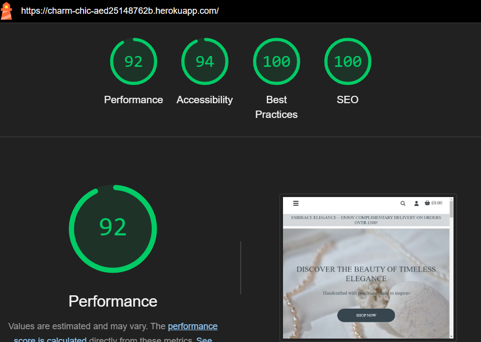
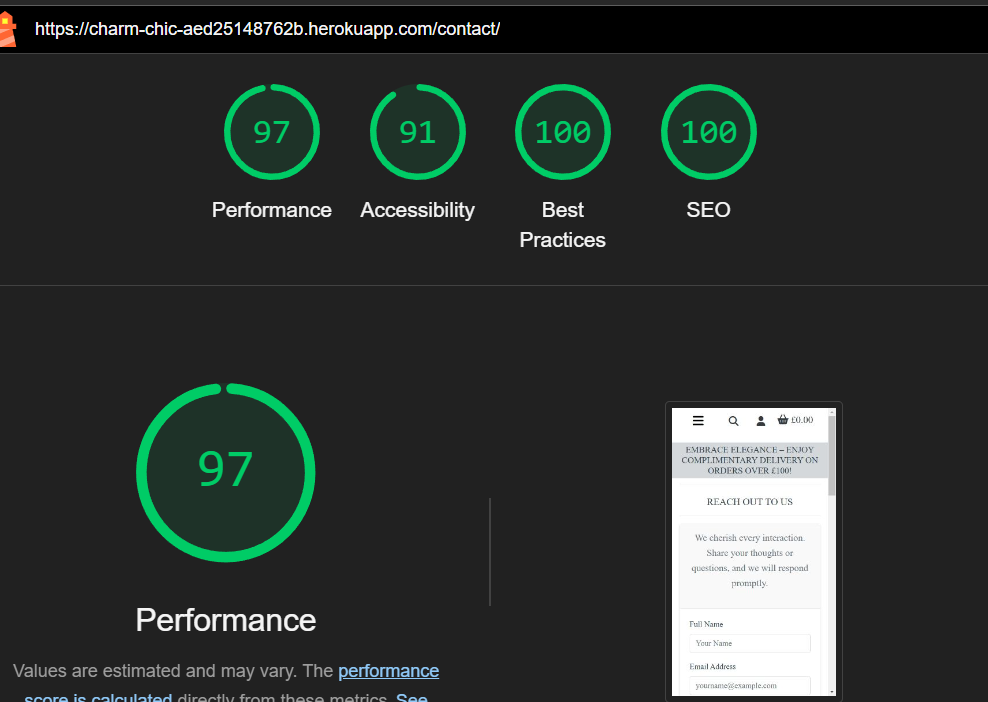
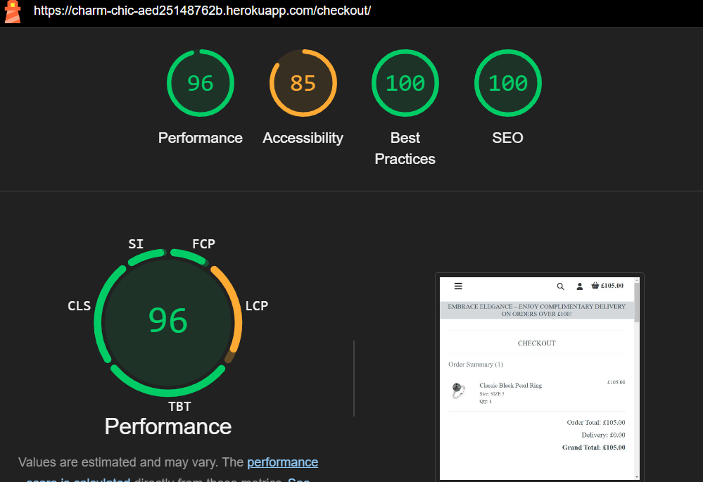
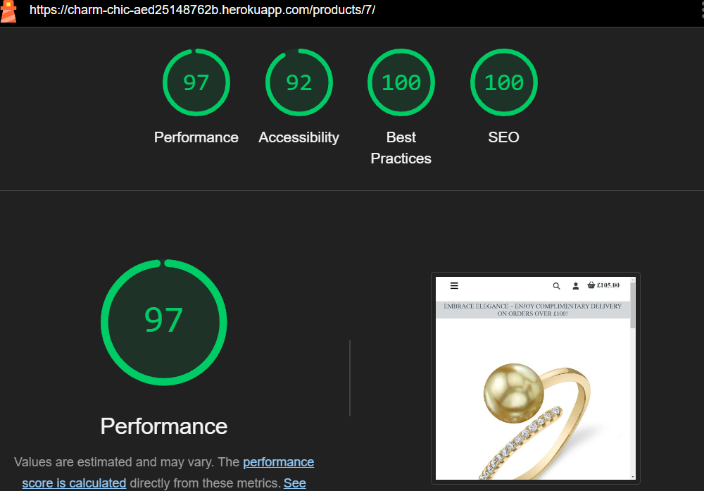
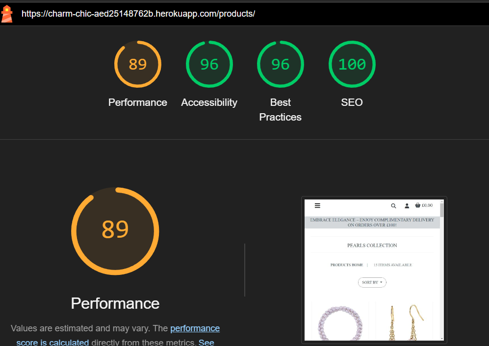
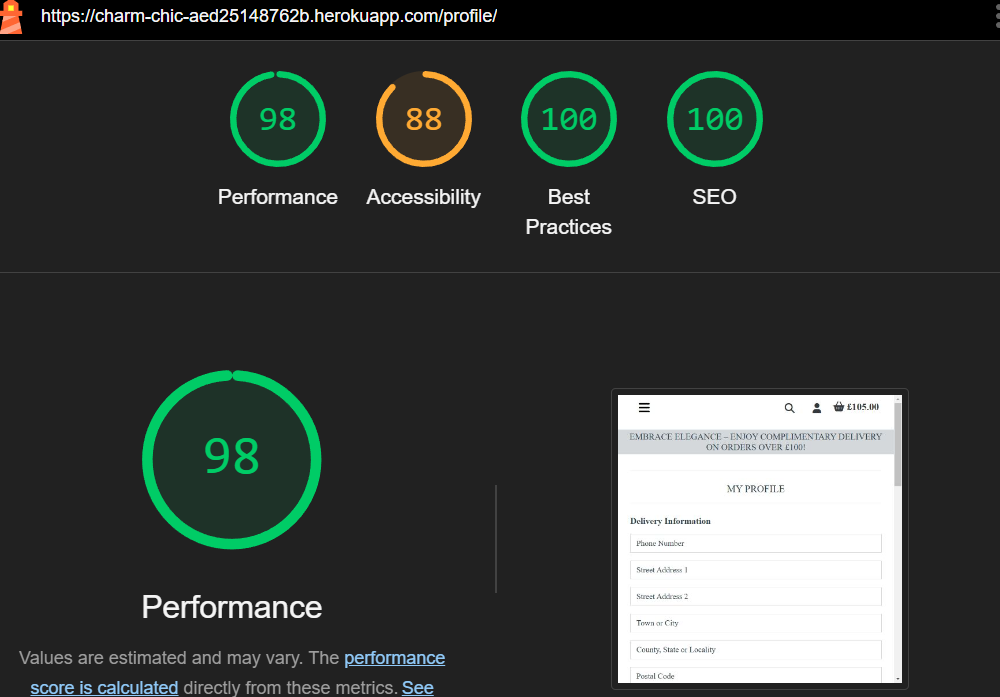
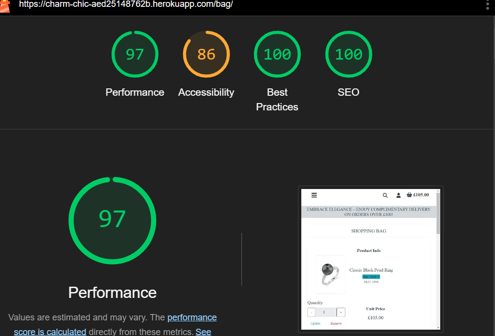
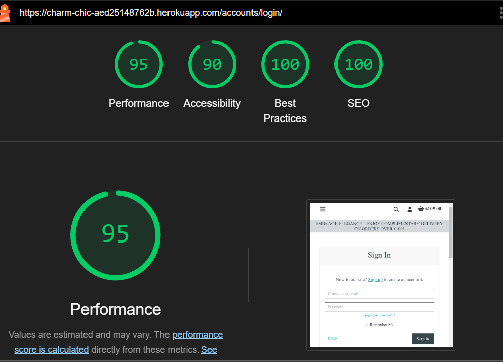
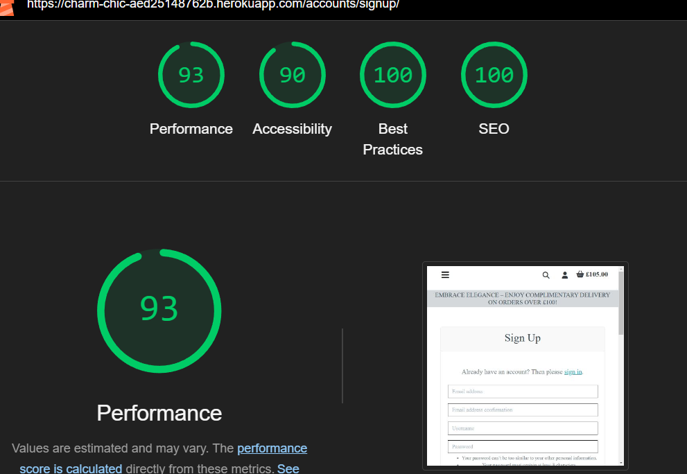

## Table of Contents

1. [Automated Testing](#automated-testing)
   - [HTML Validation](#html-validation)
   - [CSS Validation](#css-validation)
   - [Python Testing](#python-testing)
2. [Manual Testing](#manual-testing)
   - [Responsivity Testing](#responsivity-testing)
   - [Page Testing](#page-testing)
     - [Navigation Bar Testing](#navigation-bar-testing)
     - [Toast Notifications Testing](#toast-notifications-testing)
     - [Key Feature Testing](#key-feature-testing)
3. [User Stories Testing](#user-stories-testing)
4. [Lighthouse Testing](#lighthouse-testing)

---

## Automated Testing

### HTML Validation
Validated using [W3C HTML Validator](https://validator.w3.org/):
| Page                 | Errors? | Resolved Issues                          |
|----------------------|:-------:|------------------------------------------|
| Home Page            |    ✓    | Fixed missing `alt` attributes for images. |
| All Products Page    |    ✓    | Corrected duplicate IDs for sorting dropdown. |
| Product Detail Page  |    ✓    | Fixed unclosed `
` tag.              |
| Shopping Bag Page    |    ✓    | Replaced deprecated `
` tag with CSS alignment. |
| Checkout Page        |    ✓    | Corrected a missing `label` for input fields. |
| About Us Page        |    ✓    | Fixed invalid nesting of `
` within `<ul>`. |

---

### CSS Validation
Validated using [W3C CSS Validator](https://jigsaw.w3.org/css-validator/):
| File                | Errors? | Resolved Issues                          |
|---------------------|:-------:|------------------------------------------|
| `base.css`          |    ✓    | Removed invalid property `background-color: 10px;`. |
| `checkout.css`      |    ✓    | Fixed improper use of `z-index` without `position`. |
| `profile.css`       |    ✓    | Replaced invalid `float: center;` with `margin: auto;`. |
| `products.css`      |    ✓    | Corrected a missing semicolon in a media query. |

---

### Python Testing
All Python files were validated using [PEP8 Linter](https://pep8.org/) to ensure code quality and adherence to Python style guidelines.

| File                     | Errors? | Resolved Issues                          |
|--------------------------|:-------:|------------------------------------------|
| `models.py`              |    ✓    | Fixed missing docstring for class definitions. |
| `views.py`               |    ✓    | Corrected inconsistent indentation in one function. |
| `forms.py`               |    ✓    | Removed unused imports that caused linting warnings. |
| `urls.py`                |    ✓    | Corrected trailing comma in urlpatterns list. |
| `signals.py`             |    ✓    | Fixed a typo in signal handler function name. |
| `webhooks.py`            |    ✓    | Removed unnecessary print statements used for debugging. |

---

### Manual Testing Notes
While Lighthouse testing was conducted on most pages, the **Home Page** underwent **manual testing** due to its dynamic elements (e.g., video backgrounds and JavaScript-powered components). This approach ensured that all interactive and design features, such as the hero section and navigation bar, functioned correctly across different devices and browsers.

---

## Manual Testing

### Responsivity Testing

The site was rigorously tested across multiple device sizes to ensure a seamless and user-friendly experience. The following table outlines the results of the responsiveness tests:

| **Responsivity**            | **Mobile S (320px)** | **Mobile L (425px)** | **Tablet (768px)** | **Desktop (1024px)** |
|-----------------------------|:-------------------:|:--------------------:|:------------------:|:-------------------:|
| Responsive UI Components    |         ✓          |         ✓           |         ✓         |         ✓          |
| Text Adjusts Dynamically    |         ✓          |         ✓           |         ✓         |         ✓          |
| Forms are Fully Functional  |         ✓          |         ✓           |         ✓         |         ✓          |
| Button Placement is Intuitive |       ✓          |         ✓           |         ✓         |         ✓          |
| Navigation Bar is Adaptable |         ✓          |         ✓           |         ✓         |         ✓          |
| Footer Scales Effectively   |         ✓          |         ✓           |         ✓         |         ✓          |

The design responds effectively across all tested screen resolutions, maintaining visual consistency and functionality.

---

### Page Testing

#### Navigation Bar Testing
The navigation bar was tested for usability and responsiveness across all views. The following scenarios were validated:

| **Test**                                              | **Result** |
|-------------------------------------------------------|:----------:|
| Navigation links and styles load correctly            |     ✓      |
| Navigation adjusts dynamically on mobile              |     ✓      |
| All links function as expected                        |     ✓      |
| Brand logo redirects users to the home page           |     ✓      |
| Admin-specific links appear when logged in as admin   |     ✓      |
| User-specific links appear when logged in as a shopper|     ✓      |
| Anonymous users see login and register options only   |     ✓      |
| Dropdowns work smoothly in smaller screens            |     ✓      |
| Shopping bag total updates dynamically in real-time   |     ✓      |

---

#### Toast Notifications Testing
Toasts were tested to ensure users receive clear feedback on actions taken throughout the platform:

| **Test**                                       | **Result** |
|-----------------------------------------------|:----------:|
| Error toasts display during invalid operations|     ✓      |
| Success toasts confirm user actions (e.g., added to cart) | ✓ |
| Toasts dynamically update with relevant information | ✓ |
| Toasts do not obstruct the main UI or functionality | ✓ |

---

#### Key Feature Testing

| Element  | Expected Feature | Testing | Result | Fix |
| ------------- | ------------- | ------------- | ------------- | ------------- |
| Main Logo Link  | The logo is expected to redirect to the homepage when clicked.  | Tested the feature by clicking on the logo. | The feature acted as normally and redirected to the homepage. | No fix needed. |
| Shop Now Button | The link is expected to redirect to the products page when clicked.  | Tested the feature by clicking the "Shop Now" link. | The feature acted as normally and redirected to the products page. | No fix needed. |
| Search Bar   | The search bar is expected to display products based on search query. | Tested the feature by entering a product name in the search bar. | The feature acted as normally and displayed the matching products. | No fix needed. |
| My Account Icon - Register Link  | The register link is expected to redirect to the sign-up page when clicked. | Tested the feature by clicking the "Register" link. | The feature acted as normally and redirected to the account sign-up page. | No fix needed. |
| Email Verification for Registration | The system is expected to send an email to verify the user’s registration. | Tested the registration process and checked the email inbox. | The feature acted as normally and sent the verification email. | No fix needed. |
| My Account Icon - Login Link  | The login link is expected to redirect to the sign-in page when clicked. | Tested the feature by clicking the "Login" link. | The feature acted as normally and redirected to the sign-in page. | No fix needed. |
| My Account Icon - Logout Link  | The logout link is expected to sign the user out and redirect to the homepage. | Tested the feature by clicking the "Logout" link. | The feature acted as normally and logged the user out. | No fix needed. |
| Admin - Product Management Link  | The product management link is expected to redirect the admin to the product creation page. | Tested the feature by clicking the "Product Management" link. | The feature acted as normally and redirected to the product management page. | No fix needed. |

#### Navbar

| Element  | Expected Feature | Testing | Result | Fix |
| ------------- | ------------- | ------------- | ------------- | ------------- |
| Navbar text and styles | Navbar text and styles should load correctly. | Tested by reviewing the navigation bar for proper text and styles. | Navbar loaded with correct text and styling. | No fix needed. |
| Mobile header | Mobile header should appear for medium-sized screens. | Tested by resizing the browser window to medium size. | Mobile header displayed correctly on medium-sized screens. | No fix needed. |
| All nav links | All navigation links should work as intended. | Tested by clicking on each navigation link. | Links directed to the correct pages. | No fix needed. |
| Nav logo | Clicking the logo should direct users to the home page. | Tested by clicking the logo. | Logo correctly directed to the home page. | No fix needed. |
| Admin logged in links | Admin should see Product Management, My Profile, and Logout links. | Tested by logging in as admin. | Admin saw the correct links. | No fix needed. |
| Non-admin logged in links | Non-admin logged in users should see My Profile and Logout links. | Tested by logging in as a non-admin. | Non-admin user saw the correct links. | No fix needed. |
| Not logged in links | Not logged in users should see Register and Login links. | Tested by viewing as a non-logged-in user. | Correct links displayed. | No fix needed. |
| Home link | Home link should direct to the home page. | Tested by clicking on the Home link. | Home link worked as expected. | No fix needed. |
| About Us link | Clicking "About Us" should link to the About Us page. | Tested by clicking the About Us link. | Linked to the About Us page. | No fix needed. |
| All Products link | Clicking "All Products" should link to the All Products page. | Tested by clicking the All Products link. | Linked to the All Products page. | No fix needed. |
| Bracelet link | Clicking "Bracelets" should link to the Bracelet category page. | Tested by clicking the Bracelet link. | Linked to the Bracelet category page. | No fix needed. |
| Earrings link | Clicking "Earrings" should link to the Earrings category page. | Tested by clicking the Earrings link. | Linked to the Earrings category page. | No fix needed. |
| Necklaces link | Clicking "Necklaces" should link to the Necklaces category page. | Tested by clicking the Necklaces link. | Linked to the Necklaces category page. | No fix needed. |
| Rings link | Clicking "Rings" should link to the Rings category page. | Tested by clicking the Rings link. | Linked to the Rings category page. | No fix needed. |
| Mobile search icon | In mobile view, the search icon should trigger a dropdown input field. | Tested by resizing the browser to mobile view and clicking the search icon. | Input field dropdown triggered correctly. | No fix needed. |
| Search bar | Search bar should allow text input and search products. | Tested by typing a product name in the search bar. | Search bar functioned correctly. | No fix needed. |
| Bag total price | Total price in the bag should update when an item is added and link to the bag page. | Tested by adding an item to the shopping bag. | Bag price updated and linked to the bag page. | No fix needed. |
| Admin Product Management link | When logged in as admin, Product Management should link to the Add Product page. | Tested by logging in as admin and clicking the link. | Correctly redirected to Add Product page. | No fix needed. |

#### All Products Page

| Element  | Expected Feature | Testing | Result | Fix |
| ------------- | ------------- | ------------- | ------------- | ------------- |
| Fonts and images | Fonts and images should load correctly on the page. | Tested by loading the page and ensuring all fonts and images appear as expected. | Fonts and images loaded without issues. | No fix needed. |
| Product count | Product count should match the total number of products displayed. | Verified by comparing the displayed product count with the actual number of visible products. | Product count was accurate to the number of products on the page. | No fix needed. |
| Sort by dropdown | Sorting options should function as expected. | Tested by interacting with the "Sort by" dropdown and checking the resulting order. | Sorting options worked as expected. | No fix needed. |
| Sort by Price (low to high) | Products should be sorted by price from low to high. | Selected the "Price (low to high)" option and checked the product order. | Products were sorted correctly from low to high price. | No fix needed. |
| Sort by Price (high to low) | Products should be sorted by price from high to low. | Selected the "Price (high to low)" option and checked the product order. | Products were sorted correctly from high to low price. | No fix needed. |
| Sort by Name (A-Z) | Products should be sorted alphabetically from A to Z. | Selected the "Name (A-Z)" option and checked the product order. | Products were sorted alphabetically from A to Z. | No fix needed. |
| Sort by Name (Z-A) | Products should be sorted alphabetically from Z to A. | Selected the "Name (Z-A)" option and checked the product order. | Products were sorted correctly from Z to A. | No fix needed. |
| Product Home Link | "Products Home" link should redirect to the All Products page. | Clicked the "Products Home" link from a category page to check the redirection. | The link redirected correctly to the All Products page. | No fix needed. |
| Product Image | Clicking the product image should take the user to the product detail page. | Clicked on a product image and verified redirection. | The image correctly redirected to the product detail page. | No fix needed. |
| View Details link | Clicking the view details link should take the user to the product detail page. | Clicked on a product name and verified redirection. | The view details link correctly redirected to the product detail page. | No fix needed. |
| Admin User - Edit and Delete Buttons | Admin users should see Edit and Delete buttons on product listings. | Logged in as an admin and checked for the Edit and Delete buttons. | Admin users could see and interact with the buttons. | No fix needed. |
| Non-Admin User - Edit and Delete Buttons | Non-admin users should not see Edit or Delete buttons. | Logged in as a non-admin user and verified the absence of these buttons. | Non-admin users did not see the Edit and Delete buttons. | No fix needed. |
| Admin Edit Button | The Admin Edit button should redirect to the Edit Product page. | Clicked the Edit button and verified the redirection to the Edit Product page. | The Edit button worked as expected. | No fix needed. |
| Admin Delete Button | The Admin Delete button should delete a product from the database. | Clicked the Delete button and verified the product was deleted. | The Delete button functioned correctly and removed the product. | No fix needed. |

#### Product Detail Page

#### Product Detail Page

| Element  | Expected Feature | Testing | Result | Fix |
| ------------- | ------------- | ------------- | ------------- | ------------- |
| Fonts and images | Fonts and images should load correctly on the page. | Tested by loading the product detail page and ensuring all fonts and images appear. | Fonts and images loaded without issues. | No fix needed. |
| Product image | Clicking the image should open a new tab with an image preview. | Clicked on the product image to check if it opened in a new tab. | Image opened in a new tab with the preview. | No fix needed. |
| Category tag | Category tag should display correctly and match the product's category. | Verified the category tag was displayed and matched the product’s category. | Category tag displayed correctly and accurately. | No fix needed. |
| Size of item | The size of the item should be displayed correctly. | Verified that the size of the item was correctly displayed. | Size was displayed accurately for the product. | No fix needed. |
| Quantity - Decrease button | Decrease button should not work if quantity is 1. | Tested the decrease button with quantity set to 1. | Decrease button did not work when quantity was 1. | No fix needed. |
| Quantity - Decrease button | Decrease button should decrease quantity by 1 if quantity is 2 or more. | Tested the decrease button with quantity set to 2 or more. | Decrease button worked as expected. | No fix needed. |
| Quantity input field | Quantity input field should be editable by the user. | Verified the input field could be altered. | Quantity input field worked as expected and was editable. | No fix needed. |
| Quantity input field - 0 | User should not be able to add a product to the bag if the quantity is set to 0. | Set quantity to 0 and attempted to add product to the bag. | The product was not added to the bag when quantity was 0. | No fix needed. |
| Quantity - Increase button | Increase button should increase quantity by 1 if the quantity is 98 or less. | Tested the increase button with quantity set to 98 or less. | Increase button worked as expected when quantity was 98 or less. | No fix needed. |
| Quantity - Increase button | Increase button should not work if quantity is 99 or more. | Tested the increase button with quantity set to 99. | The increase button did not work when quantity was 99. | No fix needed. |
| Non-Admin User - Edit and Delete Buttons | Non-admin users should not see Edit and Delete buttons. | Verified that non-admin users could not see these buttons. | Non-admin users did not see the Edit and Delete buttons. | No fix needed. |
| Admin User - Edit and Delete Buttons | Admin users should see Edit and Delete buttons. | Logged in as an admin and verified presence of these buttons. | Admin users could see the Edit and Delete buttons. | No fix needed. |
| Admin Edit Button | Admin users should be redirected to the Edit Product page when clicking the Edit button. | Clicked the Edit button and verified redirection. | Edit button redirected to the Edit Product page. | No fix needed. |
| Admin Delete Button | Admin users should be able to delete the product by clicking the Delete button. | Clicked the Delete button and verified product removal. | Product was deleted successfully by the admin. | No fix needed. |
| Add to Bag | Clicking the "Add to Bag" button should add the product to the shopping bag and trigger a success toast. | Clicked "Add to Bag" and checked if product was added and toast message appeared. | Product was successfully added to the shopping bag, and a success toast appeared. | No fix needed. |
| Keep Shopping | Clicking the "Keep Shopping" button should redirect the user back to the Products page. | Clicked "Keep Shopping" and checked redirection. | "Keep Shopping" button redirected to the Products page. | No fix needed. |
| Rating - Stars | Rating stars should be displayed correctly, and only admins should be able to rate products after adding them. | Verified that rating stars were visible and only admins could rate. | Rating stars were visible, and only admin users could rate products. | No fix needed. |

#### Shopping Bag

| Element                     | Expected Feature                                                                 | Testing                                                                                   | Result                                                                             | Fix                                                                                   |
|-----------------------------|-----------------------------------------------------------------------------------|-------------------------------------------------------------------------------------------|-----------------------------------------------------------------------------------|---------------------------------------------------------------------------------------|
| Fonts                       | Fonts should load correctly on the shopping bag page.                              | Loaded the page and ensured all fonts display properly.                                    | Fonts loaded correctly.                                                         | No fix needed.                                                                        |
| Product Image               | Product image should be displayed for each item in the shopping bag.              | Verified images were loaded for each item in the shopping bag.                             | Product images were displayed correctly.                                           | No fix needed.                                                                        |
| Product Name                | The product name should be displayed accurately.                                  | Verified the product name matched each item in the shopping bag.                           | Product names were accurate.                                                      | No fix needed.                                                                        |
| Selected Size               | Size of the product should display if it is selected.                             | Checked if the selected size was displayed for items with a size option.                   | Size displayed correctly for products with size options.                          | No fix needed.                                                                        |
| SKU                         | SKU (Stock Keeping Unit) should be visible for each item.                         | Checked that the SKU displayed correctly for each product.                                | SKU displayed correctly for each product.                                         | No fix needed.                                                                        |
| Product Price               | Price for each product should be accurate.                                        | Verified the price for each item in the shopping bag was correct.                         | Prices were accurate.                                                             | No fix needed.                                                                        |
| Quantity Controls           | Quantity buttons (+/-) should work correctly.                                    | Tested quantity increase/decrease buttons.                                                | Quantity buttons worked as expected (decrease with quantity > 1, increase < 99). | No fix needed.                                                                        |
| Quantity Input              | User should be able to manually alter the quantity in the input field.            | Tested input field by manually changing the quantity.                                     | Quantity input field was editable.                                                | No fix needed.                                                                        |
| Quantity Validation         | User should not be able to add an item to the bag if the quantity is 0.           | Tried adding a product with quantity set to 0.                                            | Product could not be added when quantity was 0.                                   | No fix needed.                                                                        |
| Remove Button               | User should be able to remove items from the shopping bag.                        | Clicked the remove button for an item in the shopping bag.                                | Item was successfully removed.                                                    | No fix needed.                                                                        |
| Subtotal Calculation        | Subtotal should be calculated correctly based on the items in the shopping bag.   | Verified subtotal updated after adding/removing products.                                 | Subtotal was accurate based on items.                                             | No fix needed.                                                                        |
| Update Button               | Quantity update should trigger an update for the subtotal.                        | Changed item quantity and clicked the update button.                                       | Subtotal updated correctly.                                                      | No fix needed.                                                                        |
| Success Toast               | A success toast should appear when a quantity is updated.                         | Changed quantity and checked for a success notification.                                  | Success toast appeared after updating quantity.                                  | No fix needed.                                                                        |
| Bag Total                   | The bag total should reflect the sum of the items and be calculated correctly.    | Verified that the total price reflected the sum of all items.                             | Bag total displayed correctly.                                                   | No fix needed.                                                                        |
| Delivery Charges            | Delivery charges should be displayed based on the total.                          | Checked delivery charge calculation based on subtotal.                                    | Delivery charge was displayed correctly based on total.                           | No fix needed.                                                                        |
| Free Delivery Eligibility   | If total is below the free delivery threshold, a message should display.          | Tested by ensuring the free delivery message displayed when the threshold was not met.    | Free delivery message appeared if the total was below the threshold.             | No fix needed.                                                                        |
| Grand Total                 | Grand total should be accurate including all charges and discounts.              | Verified that the grand total included the correct amount of products, delivery, etc.     | Grand total was calculated correctly.                                             | No fix needed.                                                                        |
| Continue Shopping Button        | Clicking the "Continue Shopping" button should redirect to the product page.          | Clicked the "Continue Shopping" button and checked redirection.                               | "Continue Shopping" button redirected correctly to the product page.                 | No fix needed.                                                                        |
| Secure Checkout Button      | Clicking "Secure Checkout" should redirect to the checkout page.                  | Clicked "Secure Checkout" and verified redirection to checkout.                           | "Secure Checkout" redirected to the checkout page as expected.                   | No fix needed.                                                                        |
| Empty Bag Message           | If the shopping bag is empty, a notification should appear.                       | Removed all items from the shopping bag and checked for the empty bag message.           | Message appeared when the bag was empty.                                          | No fix needed.                                                                        |
| Empty Bag - Keep Shopping   | If the shopping bag is empty, the "Keep Shopping" button should redirect to the product page. | Verified the "Keep Shopping" button worked when the bag was empty.                        | "Keep Shopping" redirected to product page when the bag was empty.               | No fix needed.                                                                        |

#### Checkout

| Element                               | Expected Feature                                                                        | Testing                                                                                           | Result                                                                                      | Fix                                                                                   |
|---------------------------------------|------------------------------------------------------------------------------------------|---------------------------------------------------------------------------------------------------|--------------------------------------------------------------------------------------------|---------------------------------------------------------------------------------------|
| Form Validations                      | Secure form validations are implemented for all fields.                                  | Tested by submitting the checkout form with missing or invalid fields.                             | Form validation worked and showed appropriate error messages for required fields.          | No fix needed.                                                                        |
| Stripe Integration                    | Stripe integration ensures secure payment processing.                                    | Tested by completing a test payment through Stripe.                                                | Payment was processed securely through Stripe with no errors.                              | No fix needed.                                                                        |
| Order Confirmation Page               | Users should be redirected to a confirmation page upon order success.                    | Tested by completing a test order and checking if the user is redirected to the confirmation page. | Redirected to the confirmation page successfully after completing the order.               | No fix needed.                                                                        |
| Product Information                   | Product name, quantity, and price should be displayed correctly.                         | Verified that all product details (name, quantity, price) were correct during checkout.            | Product information displayed correctly in checkout summary.                               | No fix needed.                                                                        |
| Address Information                   | Full and accurate address information should be displayed for both billing and delivery. | Checked that all address fields (street, city, country, etc.) were correctly filled in and displayed. | Address information was displayed correctly for both delivery and billing.                | No fix needed.                                                                        |
| Payment Details                       | Payment method should be selected and processed accurately.                             | Verified payment method and checked that the payment was securely processed.                      | Payment method was processed securely with correct amount and user data.                  | No fix needed.                                                                        |                                                                        |
| Checkout Completion Redirect          | Completing the order should redirect the user to a success page after payment.           | Verified that user was redirected to the success page after order completion.                      | User was redirected to the checkout success page after completing the order.              | No fix needed.                                                                        |
| Secure Checkout Button                | Secure Checkout button should send the user to a secure payment page.                    | Tested the "Secure Checkout" button and checked redirection to Stripe payment page.                | "Secure Checkout" button redirected successfully to Stripe payment page.                  | No fix needed.                                                                        |
| Keep Shopping Button                  | Keep Shopping button should redirect users back to the product page.                     | Verified that clicking the "Keep Shopping" button took the user to the products page.             | "Keep Shopping" button redirected correctly to the products page.                          | No fix needed.                                                                        |

#### Profile

| Element  | Expected Feature | Testing | Result | Fix |
| ------------- | ------------- | ------------- | ------------- | ------------- |
| Update delivery preferences | Users can update delivery preferences. | Tested by editing preferences. | Preferences were updated successfully. | No fix needed. |
| View order history | Users can view their previous orders. | Tested by checking order history. | Previous orders were displayed correctly. | No fix needed. |

#### Admin Features

| Element  | Expected Feature | Testing | Result | Fix |
| ------------- | ------------- | ------------- | ------------- | ------------- |
| Admin product management | Admin users can add, edit, and delete products. | Tested by adding, editing, and deleting products. | Admin features worked as expected. | No fix needed. |
| Instant updates | Changes should reflect instantly on the products page. | Tested by viewing the products page after changes. | Changes were reflected instantly. | No fix needed. |

## User Stories Testing
### **Customer Stories**

| **User Story** | **Test** | **Result** | **Fix** |
|----------------|----------|------------|---------|
| **View List of Pearl Jewelry** | I have verified that a list of pearl jewelry items is displayed on the product page. | Pearl jewelry items appear and are accurately listed. | No fix needed. |
| **View Detailed Information about a Specific Product** | I have verified that clicking on a jewelry item redirects to the product detail page with all relevant information (e.g., size, color, price). | Product details such as size, color, and price display correctly. | No fix needed. |
| **Filter Jewelry by Type and Color** | I have verified that the filtering options for jewelry type and pearl color function correctly, and products are displayed according to the selected filters. | Filtering options display accurate results based on the selected criteria. | No fix needed. |
| **View Trending Jewelry** | I have verified that trending jewelry items are displayed on the homepage or a designated section, showing best sellers and new arrivals. | Trending items are visible and updated accordingly. | No fix needed. |
| **View Total of Purchases** | I have verified that the shopping bag page displays the correct subtotal, taxes, and total price. | Total cost and details are correctly calculated and displayed. | No fix needed. |
| **Register for an Account** | I have verified that the registration page accepts all required information and creates an account. | Account creation works successfully, and data is saved securely. | No fix needed. |
| **Log In/Log Out of Account** | I have verified that users can log in and log out with valid credentials. | Login and logout functionality works as expected. | No fix needed. |
| **Recover Password** | I have verified that the password recovery process works as intended, and users can recover their password through email. | User receives password recovery instructions via email. | No fix needed. |
| **Manage User Profile** | I have verified that user profile information can be updated and saved successfully. | User profile is personalized and updated correctly. | No fix needed. |
| **Sort Products** | I have verified that sorting options (price, name) work and reorder the product list accordingly. | Products are sorted based on selected criteria. | No fix needed. |
| **Search for Products** | I have verified that the search bar returns relevant results based on product name or description. | Search results are relevant to the input query. | No fix needed. |
| **Show Search Results** | I have verified that search results display the total count and searched term. | Search results are clearly displayed with a count of items. | No fix needed. |
| **Select Product Quantity** | I have verified that the quantity input field allows for easy selection and updates correctly. | Quantity is updated based on user input. | No fix needed. |
| **View Products in a Category** | I have verified that clicking on a category filter shows products from the selected category. | Correct category products are displayed. | No fix needed. |
| **Contact Support** | I have verified that the contact page is accessible and contains correct contact details. | Contact information is available and works as expected. | No fix needed. |
| **View Policies** | I have verified that links to policy pages are functional and accessible. | Policy pages are linked and display relevant information. | No fix needed. |
| **Subscribe to Newsletter** | I have verified that the subscription form is functional and users can successfully subscribe. | Subscription process works successfully. | No fix needed. |
| **Find Social Media Links** | I have verified that social media links are available in the footer and work correctly. | Social media links are visible and functional. | No fix needed. |

### **Admin Stories**

| **User Story** | **Test** | **Result** | **Fix** |
|----------------|----------|------------|---------|
| **Add New Products** | I have verified that the admin can add products through the product management interface. | New products are added and display correctly on the site. | No fix needed. |
| **Edit or Delete Products** | I have verified that admins can edit and delete product details. | Product details are updated or deleted as expected. | No fix needed. |

### **Security and Payment**

| **User Story** | **Test** | **Result** | **Fix** |
|----------------|----------|------------|---------|
| **Handle Personal and Payment Information Securely** | I have verified that secure payment processing (e.g., Stripe) is integrated and functioning. | Payment is processed securely. | No fix needed. |
| **Provide Shipping and Payment Information** | I have verified that the checkout form accepts correct details and handles errors for missing information. | Form submissions work without errors. | No fix needed. |
| **Receive Order Confirmation** | I have verified that an order confirmation page is displayed with accurate details after completing an order. | Confirmation page displays correct order information. | No fix needed. |

## Lighthouse Testing

Lighthouse was used to test the performance, accessibility, best practices, and SEO of the website. The following pages were evaluated to ensure optimal user experience:

1. **Home Page Lighthouse Results**:
   

2. **Contact Page Lighthouse Results**:
   

3. **Checkout Page Lighthouse Results**:
   

4. **Product Detail Page Lighthouse Results**:
   

5. **Products Page Lighthouse Results**:
   

6. **Profile Page Lighthouse Results**:
   

7. **Shopping Bag Page Lighthouse Results**:
   

8. **Sign In Page Lighthouse Results**:
   

9. **Sign Up Page Lighthouse Results**:
   

